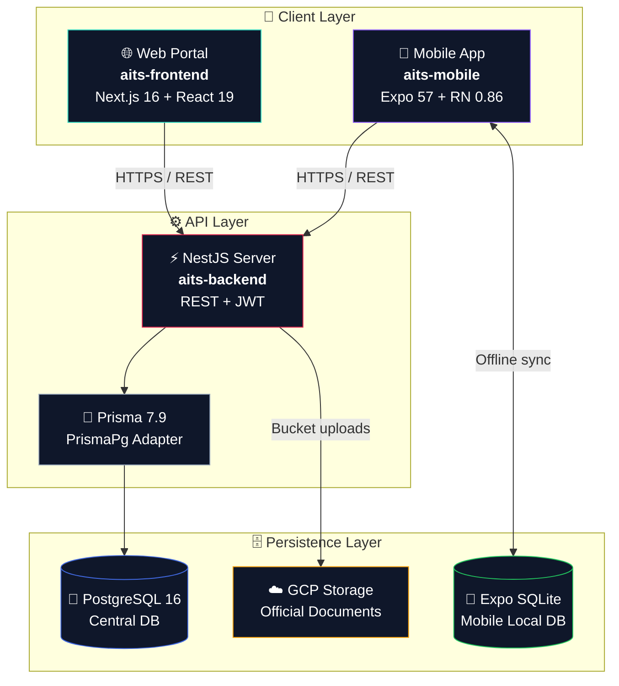

<div align="center">


<a href="https://git.io/typing-svg"></a>

<br/>

[](https://nestjs.com/)
[](https://expo.dev/)
[](https://nextjs.org/)
[](https://www.postgresql.org/)
[](https://www.prisma.io/)
[](https://www.typescriptlang.org/)
[](https://tailwindcss.com/)


<br/>

**[✨ Features](#-key-features)** &nbsp;·&nbsp;
**[🏛️ Architecture](#️-system-architecture)** &nbsp;·&nbsp;
**[📁 Monorepo](#-monorepo-structure)** &nbsp;·&nbsp;
**[🚀 Quick Start](#-quick-start)** &nbsp;·&nbsp;
**[🔐 Credentials](#-default-seed-credentials)** &nbsp;·&nbsp;
**[📜 Roles](#-system-roles)**

</div>

<br/>

## 📖 Overview

**AITS** is an end-to-end, enterprise-grade platform that modernizes **national livestock management**: disease monitoring, breeding records, ownership transfer, and biosecurity traceability.

It gives **livestock owners, government officials, veterinarians, AI technicians, and bank / insurance inspectors** real-time web dashboards plus **offline-capable mobile tools** for the field.

<div align="center">

```
                ┌─────────────────────────────────────────────────────┐
                │      🌐  AITS Central Web Portal  (Next.js 16)       │
                │   National dashboards · Farms · Health · Documents   │
                └──────────────────────────┬──────────────────────────┘
                                           │  REST  (JWT + TLS)
                                           ▼
┌────────────────────────────────────────────────────────────────────────────┐
│                     ⚡  AITS Backend Core  (NestJS 11)                      │
│   PostgreSQL 16 via Prisma 7  ·  Unique-Tag & Lineage Engine  ·  Audit Log │
│                    Idempotent Offline Sync Engine                          │
└────────────────────────────────────────────────────────────────────────────┘
                                           ▲
                                           │  REST  (JWT + Offline Queue)
                ┌──────────────────────────┴──────────────────────────┐
                │   📱  AITS Field App  (Expo / React Native 0.86)     │
                │   QR & RFID tagging · Offline SQLite · Sync manager  │
                └─────────────────────────────────────────────────────┘
```

</div>

<br/>

## ✨ Key Features

<table>
<tr>
<td width="50%" valign="top">

### 🆔 Global Identification & Tagging

- **National registry**: globally unique `animalNumber` across every farm and province
- **Multi-tag support**: `QR Code`, `RFID`, `Ear Tag`, `National ID` (primary + secondary)
- **Single-active-QR enforcement** inside DB transactions to stop duplication and fraud

</td>
<td width="50%" valign="top">

### 🌳 Lineage & Pedigree Engine

- **Self-referential genealogy** with mother/father graph for multi-generation trees
- **Calving & genetic history**: offspring counts, birth weights, lineage traits

</td>
</tr>
<tr>
<td valign="top">

### 🩺 Health, Disease & Vaccination

- **Clinical records**: `HEALTHY` · `SICK` · `UNDER_TREATMENT` · `QUARANTINED`
- **Disease severity matrix**: `CRITICAL` · `HIGH` · `MEDIUM`
- **Vaccination schedules** with automated due-date reminders

</td>
<td valign="top">

### 🥛 Production & Feeding Analytics

- **Milk yield**: morning / afternoon / evening, with Fat % and Protein %
- **Feed rations**: `GREEN_FODDER` · `CONCENTRATE` · `SILAGE` · `SUPPLEMENTS`

</td>
</tr>
<tr>
<td valign="top">

### 🧬 AI & Pregnancy Tracking

- **Breeding records** linking females, AI technicians, sire IDs, and dates
- **Expected calving calculator** with pregnancy status progression

</td>
<td valign="top">

### 🚚 Movement & Ownership

- **Inter-farm movement logs** across farms, quarantine zones, and markets
- **Ownership transfers** between users, with document verification

</td>
</tr>
<tr>
<td colspan="2" valign="top">

### 📶 Offline-First Mobile Sync

- **Local SQLite store**: field agents work fully offline in remote regions
- **Idempotent batch syncing**: queued `CREATE` / `UPDATE` operations with conflict resolution

</td>
</tr>
</table>

<br/>

## 🏛️ System Architecture

AITS is a **monorepo** of three decoupled applications:



<br/>

## 📁 Monorepo Structure

```
Animal Identification and Tracking System/
├── 📄 docker-compose.yml      # PostgreSQL + Adminer containers
├── 📄 README.md               # You are here
│
├── ⚡ aits-backend/           # NestJS service
│   ├── prisma/                #   Schema + seed (32 models)
│   ├── src/                   #   Modules: Auth, Animals, Health, QR, Sync…
│   ├── package.json           #   NestJS 11, Prisma 7.9, Pino, Bcrypt
│   └── tsconfig.json          #   NodeNext resolution
│
├── 🌐 aits-frontend/          # Next.js 16 web dashboard
│   ├── src/                   #   React 19 App Router, components, hooks
│   ├── package.json           #   Next 16, Tailwind v4, TanStack Query
│   └── next.config.ts
│
└── 📱 aits-mobile/            # Expo / React Native field app
    ├── src/                   #   Expo Router screens, SQLite schema, scanners
    ├── package.json           #   Expo 57, RN 0.86, SQLite
    └── app.json
```

<br/>

## 🗄️ Database Model Map

**32 normalized models** across **11 domains** in PostgreSQL:

|     | Domain                        | Key Models                                                                           |
| :-: | :---------------------------- | :----------------------------------------------------------------------------------- |
| 🔑  | **Authentication & Access**   | `User` `Role` `Permission` `UserRole` `RolePermission`                               |
| 🏡  | **Farm Infrastructure**       | `Farm` `FarmUser`                                                                    |
| 🐂  | **Animal Registry & Lineage** | `Animal` `AnimalIdentifier` `QRCode`                                                 |
| 🩺  | **Health & Medical**          | `HealthRecord` `Disease` `AnimalDisease` `Treatment` `Vaccination` `VeterinaryVisit` |
| 🌾  | **Feed & Production**         | `FeedType` `FeedingRecord` `MilkProduction`                                          |
| 🧬  | **Reproduction**              | `BreedingRecord` `Pregnancy` `CalvingRecord`                                         |
| 🚚  | **Movement & Ownership**      | `AnimalMovement` `OwnershipTransfer`                                                 |
| 📂  | **Document Vault**            | `DocumentType` `Document`                                                            |
| 🔔  | **Notifications**             | `Notification` `NotificationPreference`                                              |
| 🔄  | **Offline Synchronization**   | `SyncBatch` `SyncRecord`                                                             |
| 🛡️  | **Audit & System**            | `AuditLog` `SystemSetting`                                                           |

<br/>

## 🚀 Quick Start

### 📋 Prerequisites

| Tool                                                                                      | Version                              |
| :---------------------------------------------------------------------------------------- | :----------------------------------- |
|  | `node -v` → v20.x or higher          |
|             | `npm -v` → v10.x or higher           |
|  | Docker Desktop installed and running |
|               | Installed                            |

<br/>

### 1️⃣ Clone & Install

```bash
git clone https://github.com/LaKrUwaNS/Animal-Identification-and-Tracking-System.git
cd "Animal Identification and Tracking System"

# Install all three apps
(cd aits-backend  && npm install)
(cd aits-frontend && npm install)
(cd aits-mobile   && npm install)
```

### 2️⃣ Database & Backend

```bash
cd aits-backend

npm run db:docker                    # PostgreSQL :5432 + Adminer :8080
cp .env.example .env                 # environment file
npx prisma migrate dev --name init   # apply migrations
npm run seed                         # roles, permissions, diseases, admin
npm run start:dev                    # API on :3000
```

> [!TIP]
> **Adminer** is available at **http://localhost:8080**
> Server `postgres` · User `postgres` · Password `postgres` · Database `aits`

### 3️⃣ Web Portal

```bash
cd ../aits-frontend
npm run dev                          # Next.js dev server on :3001
```

> [!NOTE]
> Open the dashboard at **http://localhost:3001**. Backend and web portal both default to `3000`, so run the portal on `3001` to avoid a clash.

### 4️⃣ Mobile App

```bash
cd ../aits-mobile
npm run start                        # Expo Metro bundler
```

> [!TIP]
> Press **`a`** for Android Emulator · **`i`** for iOS Simulator · or scan the QR with **Expo Go**.

<br/>

## 🔐 Default Seed Credentials

Running `npm run seed` populates roles, permissions, disease definitions, document types, and a default **System Administrator**:

| Role                        | Email            | Password      | Environment           |
| :-------------------------- | :--------------- | :------------ | :-------------------- |
| 👑 **System Administrator** | `admin@aits.gov` | `Admin123!@#` | Development / Staging |

> [!CAUTION]
> These credentials are for **development and staging only**. Change or remove them before any production deployment.

<br/>

## 🌐 Network & Ports

| Service                   |  Port  | URL                     | Notes                  |
| :------------------------ | :----: | :---------------------- | :--------------------- |
| ⚡ **NestJS Backend**     | `3000` | `http://localhost:3000` | Main REST API          |
| 🌐 **Next.js Web Portal** | `3001` | `http://localhost:3001` | Admin & farmer web app |
| 📱 **Expo Metro**         | `8081` | Metro / WebSocket       | Mobile development     |
| 🐘 **PostgreSQL**         | `5432` | PostgreSQL protocol     | Central DB             |
| 🧰 **Adminer**            | `8080` | `http://localhost:8080` | DB management UI       |

<br/>

## 📜 System Roles

| Role                        | Scope                     | Responsibilities                                                  |
| :-------------------------- | :------------------------ | :---------------------------------------------------------------- |
| 👑 **`ADMIN`**              | System-wide               | User management, system settings, global audit logs               |
| 🧑‍🌾 **`FARMER`**             | Farm level                | Farm profiles, animal registration, milk yield & feed logging     |
| 🩺 **`VETERINARY_OFFICER`** | Regional / assigned farms | Diagnose diseases, prescribe treatments, administer vaccinations  |
| 🧬 **`AI_TECHNICIAN`**      | Regional                  | Log breeding events, inseminations, pregnancy checks              |
| 🏛️ **`GOVERNMENT_OFFICER`** | National / provincial     | Traceability inspection, movement approvals, disease surveillance |
| 🏦 **`BANK_OFFICER`**       | Inspection scope          | Asset valuation and health validation for agricultural loans      |
| 🛡️ **`INSURANCE_OFFICER`**  | Inspection scope          | Mortality claims and health-history verification                  |

<br/>

## 🧪 Testing & Code Quality

```bash
cd aits-backend
npm test                              # unit tests
npm run lint                          # ESLint
npx prettier --check "src/**/*.ts"    # formatting
```

<br/>

## 🤝 Contributing

Contributions are welcome!

1. 🍴 **Fork** the repository
2. 🌿 Create a branch: `git checkout -b feature/amazing-feature`
3. 💾 Commit: `git commit -m 'feat: add amazing feature'`
4. 🚀 Push: `git push origin feature/amazing-feature`
5. 🔀 Open a **Pull Request**

<br/>

## 📄 License

Licensed under **UNLICENSED / Proprietary**. See individual package files for details.

<div align="center">

<br/>

**Built with ❤️ for modern agricultural tech & national livestock traceability**


</div>
